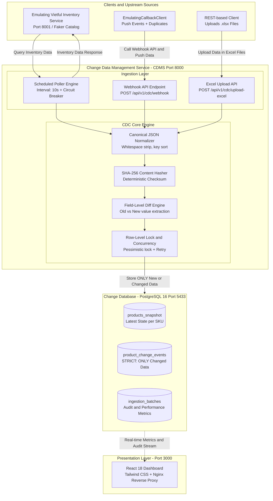
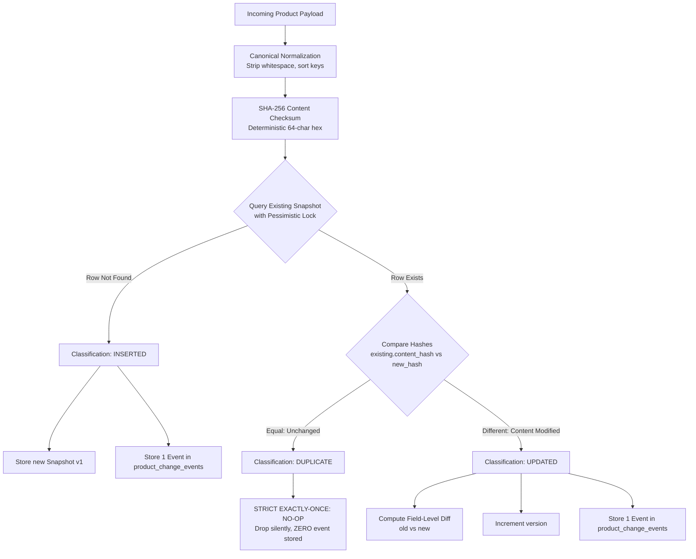

# Change Data Management Service (CDMS) - Prototype

[](https://www.python.org/)
[](https://fastapi.tiangolo.com)
[](https://reactjs.org/)
[](https://www.docker.com/)
[](https://www.postgresql.org/)
[](#testing--verification)

> **Change Data Management Service (CDMS)** is a high-performance, fault-tolerant Change Data Capture (CDC) prototype built for capturing, detecting, and storing **ONLY changed and new data** for inventory products, adhering strictly to **Exactly-Once semantics**.

---

## 🌟 Key Capabilities

1. **3 Data Ingestion Channels**:
   - **Scheduled Poller**: Periodically polls inventory data from Vietful Inventory Service on configurable intervals (default: 10s).
   - **Webhook Receiver**: Real-time REST API endpoint receiving push events from `EmulatingCallbackClient`.
   - **Excel Upload API**: In-memory streaming parser for batch product ingestion from `.xlsx` files without creating temporary disk files.
2. **Strict Exactly-Once Guarantee**:
   - **Canonical JSON Normalization** + **SHA-256 Content Hashing** to detect identical vs changed payloads.
   - **Zero Duplicate Storage**: Unchanged records are detected immediately and dropped (No-op).
   - **Field-Level Diffing**: Every update record logs exact `old` vs `new` field values.
3. **Resilience & Fault Tolerance**:
   - **Circuit Breaker** with adaptive **Exponential Backoff**: Gracefully handles upstream outages (HTTP 503) and network jitter.
   - **Row-Level Concurrency Protection**: Uses `with_for_update()` and atomic rollback/retry to prevent race conditions when multiple parallel threads ingest the same SKU.
4. **FullStack Real-Time Dashboard**:
   - Modern dark UI built with **React 18 + Tailwind CSS + Lucide Icons**.
   - Live CDC stream, Visual Diff Inspector, Drag-and-Drop Excel upload, Manual Poll trigger, Warehouse Mutation simulation, and Chaos injection.

---

## 🏗 System Architecture & Services

The architecture follows the **Basic System Specification** defined in the technical requirements, orchestrated via Docker Compose on a single machine:



### Containerized Ecosystem Summary:

| Container           | Service                    | Port (Host)             | Description                                  |
| :------------------ | :------------------------- | :---------------------- | :------------------------------------------- |
| `cdms_frontend`     | React Dashboard (Nginx)    | `http://localhost:3000` | Real-time monitoring UI & control center     |
| `cdms_backend`      | CDMS Core Engine (FastAPI) | `http://localhost:8000` | REST API, Ingestion pipelines, CDC Engine    |
| `cdms_mock_vietful` | Vietful Inventory Emulator | `http://localhost:8001` | Mock Vietful API powered by Python `Faker`   |
| `cdms_postgres`     | PostgreSQL 16 Database     | `localhost:5433`        | Relational store for Snapshots & Change Logs |

---

## 🔄 Exactly-Once Change Detection Flow



---

## 🚀 Quick Start (One Command)

### Prerequisites

- [Docker Desktop](https://www.docker.com/products/docker-desktop/) installed and running.

### 1. Launch All Services

```powershell
docker compose up -d --build
```

### 2. Verify Running Containers

```powershell
docker compose ps
```

### 3. Open the Services

- **Dashboard UI**: [http://localhost:3000](http://localhost:3000)
- **CDMS API Docs (Swagger)**: [http://localhost:8000/docs](http://localhost:8000/docs)
- **Vietful Emulator Docs (Swagger)**: [http://localhost:8001/docs](http://localhost:8001/docs)

---

## 💻 Local Development Setup (Without Docker)

### 1. Python Environment Setup

```powershell
cd backend
py -3.13 -m venv .venv
.\.venv\Scripts\Activate.ps1
pip install -r requirements.txt
```

### 2. Run Services Locally

- **Start PostgreSQL** (via Docker or local instance on port 5433):
  ```powershell
  docker compose up -d postgres
  ```
- **Start Vietful Inventory Emulator**:
  ```powershell
  $env:PYTHONPATH = "."
  uvicorn mock_vietful.app.main:app --port 8001 --reload
  ```
- **Start CDMS Backend**:
  ```powershell
  $env:PYTHONPATH = "./backend"
  uvicorn app.main:app --port 8000 --reload
  ```
- **Start Frontend Dashboard**:
  ```powershell
  cd frontend
  npm install
  npm run dev
  ```

---

## 🧪 Testing & Verification

The project includes **24 automated tests** covering unit logic, live PostgreSQL integration, REST APIs, and high-concurrency race conditions.

### Run All 24 Automated Tests

```powershell
$env:PYTHONPATH = ".;./backend"
pytest backend/tests mock_vietful/tests mock_client/tests -v
```

### Run High-Concurrency & Spike Load Benchmark

Test the live CDMS service under burst load (300 requests, 30 concurrent workers):

```powershell
$env:PYTHONPATH = ".;./backend"
python backend/tests/spike_bench.py --total 300 --concurrency 30 --pool-size 20
```

**Benchmark Results on Single Machine**:

- **HTTP 200 Success Rate**: `100.0%` (300/300 requests)
- **Throughput**: `~79 Requests/second (RPS)`
- **Median Latency (p50)**: `107 ms`
- **Duplicates Prevented**: Proved mathematically in PostgreSQL snapshot tables.

### Run Emulating Callback Client

Simulate external webhook pushes with duplicate injection:

```powershell
python -m mock_client.callback_client --url http://localhost:8000/api/v1/cdc/webhook --count 10 --duplicate-ratio 0.4
```

---

## 📁 Repository Structure

```text
├── backend/
│   ├── app/
│   │   ├── api/cdc.py             # REST API routers (Webhook, Excel, Queries)
│   │   ├── core/config.py         # Pydantic v2 Settings & environment variables
│   │   ├── db/                    # SQLAlchemy async/sync session management
│   │   ├── models/product.py      # PostgreSQL ORM entities (Snapshot, Event, Batch)
│   │   ├── schemas/product.py     # Pydantic models matching Vietful API
│   │   ├── services/
│   │   │   ├── change_detection.py# Exactly-Once engine, SHA-256 hashing, diffing
│   │   │   ├── excel_service.py   # In-memory Excel streaming parser (openpyxl)
│   │   │   └── poller.py          # Scheduled Poller with Circuit Breaker
│   │   └── main.py                # FastAPI app with lifespan manager
│   ├── tests/                     # Test suite (Unit, Postgres, Concurrency, Benchmark)
│   ├── Dockerfile                 # Backend containerization
│   └── requirements.txt           # Python dependencies
├── mock_vietful/                  # Emulating Vietful Inventory Service
│   ├── app/                       # FastAPI mock service using Faker
│   ├── tests/                     # Unit tests for emulator API
│   └── Dockerfile                 # Emulator containerization
├── mock_client/                   # Emulating Callback Client
│   ├── callback_client.py         # Webhook pusher script with duplicate simulation
│   └── tests/                     # Unit tests for callback client
├── frontend/                      # React 18 + Tailwind CSS Dashboard
│   ├── src/                       # React components (App, DiffModal)
│   ├── Dockerfile                 # Multi-stage Nginx containerization
│   ├── nginx.conf                 # Nginx reverse proxy configuration
│   └── package.json               # Node dependencies
├── docker-compose.yml             # Full-stack multi-container orchestration
├── ARCHITECTURE.md                # Deep-dive architecture & Exactly-Once design
├── LESSONS_LEARNED.md             # Technical lessons & engineering trade-offs
└── FEATURES_AND_AI_TRANSPARENCY.md# Feature checklist & AI tool disclosure
```

---
